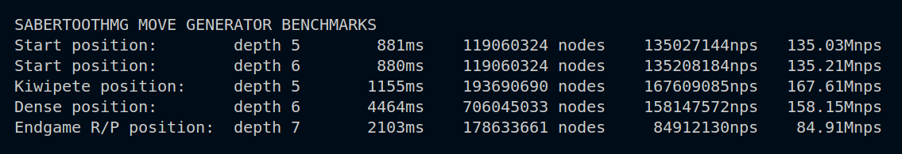

[](http://www.gnu.org/licenses/gpl-3.0)
[](https://godoc.org/github.com/IlikeChooros/dragontoothmg)


Dragontooth Movegen (Maintained Fork)
=====================================

> **Note:** This is a fork of the original [dragontoothmg](https://github.com/dylhunn/dragontoothmg) repository by Dylan D. Hunn. The original repository appears to be abandoned. This fork serves to maintain the project and add requested features.

Dragontooth Movegen is a fast, no-compromises chess move generator written entirely in Go. It provides a simple API for `GenerateLegalMoves()`. It also provides `Board` and `Move` types, `Make()` and `Undo()` functionality, and easy-to-use Zobrist-backed hashing of board positions. FEN parsing/serializing and Move parsing/serializing are supported out of the box.

`Dragontoothmg` is based on *magic bitboards* for maximum performance, and generates legal moves only using *pinned piece tables*.

**This project is currently stable and fully functional.** Optimizations are underway, to improve on the benchmarks listed below.

New Features in this Fork
=========================

*   Introduced `Make()` and `Undo()` functions for efficient move making/unmaking with internal history state.
`Apply()` still exists for compatibility, but `Make()` is recommended for performance.
*   Added `IsRepetition(nTime int)` function to check for position repetitions.
*   Added `IsTerminated(moveCount int) bool` function to check for game termination conditions.
*   Introduced `Termination` type to represent various termination states (Checkmate, Stalemate, etc.).
*   Set `kDefaultMoveListLength` to 35, reflecting the average branch factor in chess.
*   Made various previously unexported types and functions exported for better usability, for example `WhiteCanCastleQueenside`, `BlackCanCastleKingside`, etc.
*  Added `ShortAlgebraicToMove(salg string, board *Board) (Move, error)` function to parse short algebraic notation moves (e.g., "e4", "Nf3", "O-O").
*   Added `FromFen(fen string) (*Board, bool)` function, supporting 'extended' FEN string with `moves <move1> <move2> ...` at the end to reconstruct move history (moves are in long algebraic form). (e.g `rnbqkbnr/pppppppp/8/8/8/8/PPPPPPPP/RNBQKBNR w KQkq - 0 1 moves e2e4 e7e5`)

Repo summary
============

Here is a summary of the important files in the repo:

| **File**     | **Description**                                                                                                                                      |
|--------------|------------------------------------------------------------------------------------------------------------------------------------------------------|
| movegen.go   | This is the "primary" source file. Functions are located here if, and only if, they are performance critical and executed to generate moves in-game. |
| types.go     | This file contains the Board and Moves types, along with some supporting helper functions and types.                                                 |
| constants.go | All constants for move generation are hard-coded here, along with functions to compute the magic bitboard lookup tables when the file loads.         |
| util.go      | This file contains supporting library functions, for FEN reading and conversions.                                                                    |
| apply.go     | This provides functions to apply and unapply moves to the board. (Useful for Perft as well.)                                                         |
| perft.go     | The actual Perft implementation is contained in this file.                                                                                           |

API
===

Here are significant API calls that this library provides. For invocation details, see the [docs](https://godoc.org/github.com/IlikeChooros/dragontoothmg).

| **Function**              | **Description**                                                                                                       |
|---------------------------|-----------------------------------------------------------------------------------------------------------------------|
| GenerateLegalMoves        | A fast way to generate all moves in the current position.                                                             |
| Board.Apply *(Deprecated)*| Apply a move to the board. Returns a function that allows it to be unapplied. This caused huge performance issues.    |
| Board.Make                | Apply a move to the board.                                                                                            |
| Board.Undo                | Undo the last move made on the board.                                                                                 |
| Board.IsRepetition        | Check if the current position has occurred a specified number of times.                                               |
| Board.IsTerminated        | Check if the game has reached a termination condition (checkmate, stalemate, etc.).                                   |
| Board.Termination         | Get the termination state of the game. Should be only called after `IsTerminated` returns true.                       |
| Board.MakeNullMove        | Make a null move (pass the turn to the opponent).                                                                     |
| Board.UndoNullMove        | Undo a null move.                                                                                                     |
| Perft                     | Standard "performance test," which recursively counts all of the moves from a position to a given depth.              |
| ParseFen                  | Construct a Board from a standard chess FEN string.                                                                   |
| Board.ToFen               | Convert a Board to a standard FEN string.                                                                             |
| Board.Hash                | Generate a hash value for a Board, using the Zobrist method.                                                          |
| ParseMove                 | Parse a long-algbraic notation move from a string.                                                                    |
| Move.String               | Convert a Move to a string, in normal long-algebraic notation.                                                        |

Installing and building the library
===================================

This project requires Go 1.21+

To use this package in your own code, make sure your `GO_PATH` environment variable is correctly set, and install it using `go get`:

    go get github.com/IlikeChooros/dragontoothmg

Then, you can include it in your project:

	import "github.com/IlikeChooros/dragontoothmg"

Alternatively, you can clone it yourself:

    git clone https://github.com/IlikeChooros/dragontoothmg.git

Testing and benchmarking
========================

To run all tests, `cd` into the directory and use:

	go test -v

The `-v` shows verbose progress output, since some of the Perft tests can take some time.

To run benchmarks:

	go run bench/runbench.go

<!-- Current benchmark results are around 60 million NPS (nodes per second) on a modern Intel i5. This [significantly outperforms](http://i68.tinypic.com/r8rwow.png) the best current Go chess engines, and is about 40% of the performance of the Stockfish move generator. (Not bad for a garbage-collected language!) Improvements are continually underway, and results will vary on your machine. -->

Current benchmark results are around 30% higher than [dylhunns orignial repo](https://github.com/dylhunn/dragontoothmg). The results shown below are from an AMD Ryzen 9 8945hs processor, these may vary on your machine.

Dylhann's Original Repo:



This Fork:


<!--  -->

Documentation and examples
==========================

You can find the documentation [here](https://godoc.org/github.com/IlikeChooros/dragontoothmg).

Here is a simple example invocation:

```go

// Import the package (yes, this is the repo)
import "github.com/IlikeChooros/dragontoothmg"

// ...

// Read a position from a FEN string
board := dragontoothmg.ParseFen("1Q2rk2/2p2p2/1n4b1/N7/2B1Pp1q/2B4P/1QPP4/4K2R b K e3 4 30")
// Generate all legal moves
moveList := board.GenerateLegalMoves()
// For every legal move
for _, currMove := range moveList {
    // Apply it to the board
    board.Make(currMove)
    // Print the move, the new position, and the hash of the new position
    fmt.Println("Moved to:", &currMove) // Reference converts Move to string automatically
    fmt.Println("New position is:", board.ToFen())
    fmt.Println("This new position has Zobrist hash:", board.Hash())
    // Unapply the move
    board.Undo()
}
```
